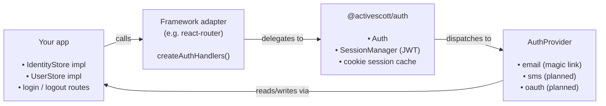

# @activescott/auth

Framework-agnostic authentication for TypeScript with a provider pattern. Designed to run on Node and edge runtimes (Workers, Vercel Edge, etc.).

Used in production by [ramblefeed.com](https://ramblefeed.com) and [tinkerbellbot.com](https://tinkerbellbot.com).

## Status

- **Email magic link** — implemented and in production.
- **SMS magic link / OTP codes** — planned, not yet implemented.
- **OAuth providers** (Google, GitHub, etc.) — planned, not yet implemented.

The provider interface (`AuthProvider` in `@activescott/auth`) is the extension point. Implementing a new provider does not require changes to the core package.

## Packages

| Package                                                                          | Description                                                                                                                               |
| -------------------------------------------------------------------------------- | ----------------------------------------------------------------------------------------------------------------------------------------- |
| [`@activescott/auth`](./packages/auth)                                           | Core: `Auth` class, `SessionManager`, types (`AuthProvider`, `IdentityStore`, `UserStore`), JWT-cookie sessions.                          |
| [`@activescott/auth-provider-email`](./packages/auth-provider-email)             | Email magic link provider. Ships a Nodemailer SMTP transport; the `EmailTransport` interface lets you swap in others (Resend, SES, etc.). |
| [`@activescott/auth-adapter-react-router`](./packages/auth-adapter-react-router) | React Router v7 adapter. Provides `createAuthHandlers`, `requireAuth`, `optionalAuth`, `getSession`, `logout`, `sendMagicLink`.           |

Adapters for other frameworks (Hono, Next.js, SvelteKit, plain Fetch handlers) can be added — they're thin wrappers around `Auth.handleRequest(request)` and `Auth.verifySession(request)`, both of which take a standard `Request`.

## Architecture



You bring two adapters — `IdentityStore` and `UserStore` — that read/write your database. The library handles tokens, cookies, provider routing, and session verification.

An `Identity` is a `(provider, identifier)` pair (e.g. `("email", "alice@example.com")`) linked to one of your `User` records. One user can have multiple identities — the data model is ready for a future where a user signs in via email _and_ Google.

## Install

```bash
npm install @activescott/auth @activescott/auth-provider-email @activescott/auth-adapter-react-router
```

## React Router quick start

A complete, runnable example lives in [`examples/react-router`](./examples/react-router) — a real React Router v7 framework-mode app with login, logout, a protected dashboard, and a Playwright e2e suite. CI runs the example end-to-end on every PR.

If you'd rather wire it into an existing app, the steps are:

### Step 1 — Implement `IdentityStore` and `UserStore`

Two interfaces from `@activescott/auth` that read/write your database. Identities are `(provider, identifier)` rows; users are your own user records. See [`examples/react-router/app/lib/auth.server.ts`](./examples/react-router/app/lib/auth.server.ts) for in-memory versions you can replace with Prisma/Drizzle/Kysely/raw SQL/Redis/etc.

### Step 2 — Configure `Auth` (server-only)

```ts
// app/lib/auth.server.ts
import { Auth } from "@activescott/auth"
import { EmailProvider } from "@activescott/auth-provider-email"
import {
  createAuthHandlers,
  sendMagicLink as sendMagicLinkBase,
} from "@activescott/auth-adapter-react-router"

export const auth = new Auth({
  session: {
    secret: process.env.JWT_SECRET!,
    maxAge: "30d",
    cookieName: "session",
    cookie: { secure: true, sameSite: "lax", path: "/" },
  },
  identityStore, // from step 1
  userStore, // from step 1
  providers: [
    new EmailProvider({
      magicLinkSecret: process.env.JWT_MAGIC_LINK_SECRET!,
      magicLinkExpiry: "5m",
      smtp: {
        /* host, port, user, pass */
      },
      from: process.env.FROM_EMAIL!,
    }),
  ],
})

export const { handleAuth, getSession, requireAuth, optionalAuth, logout } =
  createAuthHandlers(auth, {
    successRedirect: "/",
    errorRedirect: "/login",
    loginUrl: "/login",
  })

export const sendMagicLink = (email: string, baseUrl: string) =>
  sendMagicLinkBase(auth, email, baseUrl)
```

### Step 3 — Add the catch-all auth route

A single file at `app/routes/auth.$provider.$action.tsx` handles every provider's HTTP endpoints (`/auth/email/verify`, `/auth/email/initiate`, future `/auth/google/callback`, etc.):

```tsx
import { handleAuth } from "~/lib/auth.server"
import type { Route } from "./+types/auth.$provider.$action"

export const loader = ({ request }: Route.LoaderArgs) => handleAuth({ request })
export const action = ({ request }: Route.ActionArgs) => handleAuth({ request })
```

`handleAuth` dispatches to the right provider, runs `verify` or `initiate`, sets/clears the session cookie, and returns a redirect.

### Step 4 — Add `login` and `logout` routes

`login.tsx` action calls `sendMagicLink(email, baseUrl)`. `logout.tsx` action/loader calls `logout()`. See the example for the full files (~30 lines each).

### Step 5 — Protect routes with `requireAuth`

In any loader:

```tsx
export async function loader({ request }: Route.LoaderArgs) {
  const user = await requireAuth(request) // redirects to /login if no session
  return { user }
}
```

Use `optionalAuth(request)` instead if the route should render for both signed-in and signed-out users.

---

For a richer pattern — extending `AuthUser` with your own user fields and getting a typed `requireAuth<TUser>` via `mapUser` — see the production usage in ramblefeed (referenced in [`examples/react-router/README.md`](./examples/react-router/README.md)).

## Testing apps that use this library

The example also demonstrates the recommended e2e pattern (also used in production by ramblefeed and tinkerbellbot):

1. Set `additionalSecrets: [process.env.E2E_MAGIC_LINK_SECRET]` on the `EmailProvider` config — these secrets are accepted by the verifier in addition to the primary secret.
2. In your test helper, mint a magic-link JWT signed with that e2e secret and visit `/auth/email/verify?token=...` directly.

This exercises the real verify → cookie → `requireAuth` path with no SMTP server, no inbox polling, and no flaky waits. See [`examples/react-router/tests/helpers/auth.ts`](./examples/react-router/tests/helpers/auth.ts).

## Implementing a custom provider

Implement the [`AuthProvider`](./packages/auth/src/types.ts) interface from `@activescott/auth` and pass an instance into `new Auth({ providers: [...] })`.

The cleanest reference is the email provider itself: [`packages/auth-provider-email/src/email-provider.ts`](./packages/auth-provider-email/src/email-provider.ts) — a complete, production implementation showing how `initiate` / `verify` / `canHandle` / `getRoutes` fit together, how to use the `AuthContext` to look up or create the user via the stores, and how to surface errors with `AuthErrors`.

## Development

```bash
npm install
npm run build      # builds all workspaces
npm run typecheck
npm test
```

This is an npm workspaces monorepo.

## Release process

Releases are fully automated from `main`. They use [Conventional Commits](https://www.conventionalcommits.org/) plus per-package independent versioning via [`@simple-release`](https://www.npmjs.com/package/@simple-release/core), and publish to npm with [trusted publishing](https://docs.npmjs.com/trusted-publishers) (OIDC).

### Commit message rules

Enforced locally by a `husky` `commit-msg` hook running `commitlint` (see `commitlint.config.js`):

- **Type prefix** required: `feat`, `fix`, `chore`, `docs`, `refactor`, `test`, etc. (`@commitlint/config-conventional`).
- **Scope is required and restricted** to one of the package directory names:
  - `auth`
  - `auth-provider-email`
  - `auth-adapter-react-router`
  - `examples` — for changes under `examples/` (no release, since example workspaces are `private`)
- **Breaking changes** use `!` after the scope or a `BREAKING CHANGE:` footer.

Examples:

```
feat(auth): add SessionManager.refresh()
fix(auth-provider-email): handle empty SMTP response
chore(auth-adapter-react-router): bump react-router peer to ^7.13
feat(auth)!: rename IdentityStore.findByProviderAndIdentifier
```

The commit's scope determines which package gets bumped. A commit scoped to `auth` only bumps `@activescott/auth`; multi-package changes need separate commits per scope.

### Merging PRs

Because release versioning is driven by individual commits, **squash-merging a multi-package PR collapses everything under one commit with one scope** — only that scope's package will be bumped, and the other packages' changes ship un-released. Pick whichever fits the PR:

- **Single package** → squash-merge is fine.
- **Multiple packages** → either:
  1. **Rebase-merge** (preserves the per-scope commits so each package gets its bump), or
  2. **Split into one PR per package**, each squash-mergeable.

The most common pattern here is option 2 — one PR per package keeps reviews focused and release notes clean.

### Version bump rules

Standard conventional-commit semantics, applied independently per package:

| Commit                                    | Bump       |
| ----------------------------------------- | ---------- |
| `fix(scope):`                             | patch      |
| `feat(scope):`                            | minor      |
| `feat(scope)!:` or `BREAKING CHANGE:`     | major      |
| `chore`, `docs`, `refactor`, `test`, etc. | no release |

### CI pipeline (`.github/workflows/ci.yaml`)

Three jobs run on every push to `main`:

1. **`validate`** — `npm ci`, `build`, `typecheck`, `test`. Also runs on PRs.
2. **`release`** (main only) — runs `scripts/release.ts`, which uses `@simple-release` to:
   - Walk commits since the last tag for each package.
   - Bump versions, update `CHANGELOG.md`, commit, tag (`auth@0.1.2`, `auth-provider-email@0.1.3`, …), and push.
   - Create GitHub Releases.
   - Emit `packages-to-publish.json` listing only the packages that actually got bumped.
3. **`publish`** (main only, matrix over `packages-to-publish.json`) — for each bumped package: `npm ci`, `npm run build`, `npm publish --access public`. Authentication uses npm trusted publishing via OIDC (`id-token: write` in workflow permissions); no long-lived `NPM_TOKEN` is required once trusted publishing is configured for each package on npmjs.com.

If no packages were bumped (e.g. a `chore:` commit), the publish job is skipped.

### Releasing

There is no manual release command. To release: merge a PR with conventional-commit messages into `main`. CI handles the rest.

### Branch protection on `main` — why "Require pull request" is OFF

`main` is protected with required status checks (`validate`, `example-e2e`) but **does not** require a pull request before merging. That's deliberate.

The release job needs to push the `chore(release): monorepo release` bump commit + per-package tags directly to `main`. On a personal GitHub repo (not org-owned), there's no way to grant `github-actions[bot]` a bypass for the "require pull request" rule:

- Classic branch protection's `bypass_pull_request_allowances` is org-only — the API rejects it on personal repos with `"Only organization repositories can have users and team restrictions"`.
- Repo rulesets accept an `Integration` bypass actor, but require the integration to be installed at the org level — the GitHub Actions integration on a personal repo isn't, so the API rejects with `"Actor GitHub Actions integration must be part of the ruleset source or owner organization"`.
- The available bypass actor types on a personal repo (`RepositoryRole`, `DeployKey`) don't map to the `github-actions[bot]` identity.

So on a personal repo the realistic options are: (a) drop the PR requirement and rely on status checks alone, (b) wire the release job to a PAT/GitHub App token that bypasses protection, or (c) refactor the release flow to land bumps via auto-merging PRs. We've picked (a) — status checks still gate every push, and human contributors are still expected to use PRs by convention. The trade-off: an admin with direct push access could in principle bypass review. For this repo's scale that's acceptable; revisit if/when the project moves under an org.

## License

MIT
