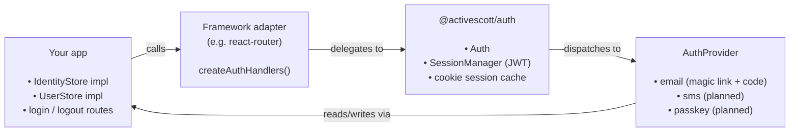

# @activescott/auth

[](https://www.npmjs.com/package/@activescott/auth)
[](https://opensource.org/licenses/MIT)

Passwordless, framework-agnostic authentication for TypeScript. Email magic links and one-time codes today; SMS and passkeys planned. Runs on Node and edge runtimes (e.g. Cloudflare Workers).

Used in production by [ramblefeed.com](https://ramblefeed.com) and [tinkerbellbot.com](https://tinkerbellbot.com).

## Why direct, passwordless authentication?

Everyone has an email address or a phone number. Nobody wants another password. And many users hesitate at "Sign in with Google/Apple/Microsoft" because it shares their sign-in activity with a third party. This library focuses on the ways a person can authenticate **directly** with your app:

- **Lowest friction for your users.** No password to create, forget, or reset, and no account with a third party required. Modern platforms AutoFill the codes we send, so signing in is: type your email, type the code your OS offers you.
- **Easiest for you.** No OAuth app registrations, no identity-provider dashboards, no extra services. An SMTP server and your database are the only dependencies.
- **Private by design.** No third-party identity provider in the loop — big tech doesn't learn when (or that) your users sign in to your app.
- **Deliberately small.** This is not a works-with-every-OAuth-provider auth library — that niche is well served by projects like [BetterAuth](https://www.better-auth.com/). Constraining the scope is what keeps this one easy to drop into a new app.

Passkeys (planned) push the same idea further: phishing-resistant, no shared secret, and still no third party.

## Features

- ✅ **Email magic links** — single-use, server-backed sign-in links with a confirm step that email security scanners can't consume (see [FAQ](#faq)). In production.
- ✅ **Email one-time codes** — every sign-in email also includes a numeric code with iOS/macOS AutoFill support, so users can type the code instead of switching to the inbox tab.
- ✅ **Bring your own database** — three small store interfaces (`IdentityStore`, `UserStore`, `ChallengeStore`); implement them with Prisma, Drizzle, raw SQL, Redis, whatever you use.
- ✅ **Edge-ready, [WinterTC-compatible](https://wintertc.org/faq) core** — standard Fetch `Request`/`Response`, WebCrypto, and [`jose`](https://github.com/panva/jose) for session JWTs; no Node-only APIs, so it runs on Cloudflare Workers, Deno, Bun, and any WinterTC-aligned runtime.
- ✅ **React Router v7 adapter** — `createAuthHandlers`, `requireAuth`, `optionalAuth`, `getSession`, `logout`.
- ✅ **SMS one-time codes** — vendor-neutral provider with Twilio and AWS transports (RCS-ready), [WebOTP](https://developer.mozilla.org/docs/Web/API/WebOTP_API) autofill support, and interactive provisioning scripts.
- 🔜 **Passkeys (WebAuthn)** — planned.

The provider interface (`AuthProvider` in `@activescott/auth`) is the extension point. Implementing a new provider does not require changes to the core package.

## Try the example

```bash
npm ci && npm run build
npm run dev --workspace=examples/react-router
```

Open http://localhost:5173/login. Sign-in emails are printed to the server console (magic link + code) — no SMTP needed.

To see the actual emails, install and run [Mailpit](https://mailpit.axllent.org) (`brew install mailpit && mailpit`), then:

```bash
cp examples/react-router/.env.example.mailpit examples/react-router/.env
```

Restart the dev server; emails land in the Mailpit inbox at http://localhost:8025.

The same app also demonstrates **SMS sign-in** — open the Phone tab (http://localhost:5173/login?via=sms); codes are printed to the console with the default `SMS_TRANSPORT=console`, or texted for real once you run the Twilio setup script (`./infra/twilio/setup-twilio.mts`). See the [example README](./examples/react-router#send-real-texts).

## Install

```bash
npm install @activescott/auth @activescott/auth-provider-email @activescott/auth-adapter-react-router
```

## React Router quick start

A complete, runnable example lives in [`examples/react-router`](./examples/react-router) — a real React Router v7 framework-mode app with login, logout, a protected dashboard, and a Playwright e2e suite. CI runs the example end-to-end on every PR.

If you'd rather wire it into an existing app, the steps are:

### Step 1 — Implement `IdentityStore` and `UserStore`

Two interfaces from `@activescott/auth` that read/write your database. Identities are `(provider, identifier)` rows; users are your own user records. See [`examples/react-router/app/lib/auth.server.ts`](./examples/react-router/app/lib/auth.server.ts) for in-memory versions you can replace with Prisma/Drizzle/Kysely/raw SQL/Redis/etc.

### Step 2 — Configure `Auth` (server-only)

```ts
// app/lib/auth.server.ts
import { Auth, InMemoryChallengeStore } from "@activescott/auth"
import { EmailProvider } from "@activescott/auth-provider-email"
import { createAuthHandlers } from "@activescott/auth-adapter-react-router"

export const auth = new Auth({
  session: {
    secret: process.env.JWT_SECRET!,
    maxAge: "30d",
    cookieName: "session",
    cookie: { secure: true, sameSite: "lax", path: "/" },
  },
  identityStore, // from step 1
  userStore, // from step 1
  // single-instance default; implement ChallengeStore against your DB
  // when running multiple instances
  challengeStore: new InMemoryChallengeStore(),
  providers: [
    new EmailProvider({
      smtp: {
        /* host, port, user, pass */
      },
      from: process.env.FROM_EMAIL!,
    }),
  ],
})

export const { handleAuth, getSession, requireAuth, optionalAuth, logout } =
  createAuthHandlers(auth, {
    successRedirect: "/",
    errorRedirect: "/login",
    loginUrl: "/login",
  })
```

No token secrets to manage for sign-in emails — links and codes are backed by server-side challenges in the `challengeStore` (the session cookie still uses `JWT_SECRET`).

### Step 3 — Add the catch-all auth route

A single file at `app/routes/auth.$provider.$action.tsx` handles every provider's HTTP endpoints (`/auth/email/initiate`, `/auth/email/verify`, future `/auth/sms/...`, etc.):

```tsx
import { handleAuth } from "~/lib/auth.server"
import type { Route } from "./+types/auth.$provider.$action"

export const loader = ({ request }: Route.LoaderArgs) => handleAuth({ request })
export const action = ({ request }: Route.ActionArgs) => handleAuth({ request })
```

`handleAuth` dispatches to the right provider, runs `verify` or `initiate`, sets/clears the session cookie, and returns a redirect.

### Step 4 — Add `login` and `logout` routes

The login page needs no action — its forms post directly to the auth routes: the email form to `/auth/email/initiate` (redirects back with `?sent=1` and sets the challenge cookie) and the code form to `/auth/email/verify`. `logout.tsx` action/loader calls `logout()`. See the example for the full files.

### Step 5 — Protect routes with `requireAuth`

In any loader:

```tsx
export async function loader({ request }: Route.LoaderArgs) {
  const user = await requireAuth(request) // redirects to /login if no session
  return { user }
}
```

Use `optionalAuth(request)` instead if the route should render for both signed-in and signed-out users.

---

For a richer pattern — extending `AuthUser` with your own user fields and getting a typed `requireAuth<TUser>` via `mapUser` — see the production usage in ramblefeed (referenced in [`examples/react-router/README.md`](./examples/react-router/README.md)).

## Architecture



You bring three adapters — `IdentityStore`, `UserStore`, and `ChallengeStore` — that read/write your database. The library handles challenges, cookies, provider routing, and session verification (and cleans up after itself: challenges are single-use and expire).

An `Identity` is a `(provider, identifier)` pair (e.g. `("email", "alice@example.com")`) linked to one of your `User` records. One user can have multiple identities — the data model is ready for a future where a user signs in via email _and_ their phone number.

## Packages

| Package                                                                          | Description                                                                                                                               |
| -------------------------------------------------------------------------------- | ----------------------------------------------------------------------------------------------------------------------------------------- |
| [`@activescott/auth`](./packages/auth)                                           | Core: `Auth` class, `SessionManager`, types (`AuthProvider`, `IdentityStore`, `UserStore`), JWT-cookie sessions.                          |
| [`@activescott/auth-provider-email`](./packages/auth-provider-email)             | Email magic link provider. Ships a Nodemailer SMTP transport; the `EmailTransport` interface lets you swap in others (Resend, SES, etc.). |
| [`@activescott/auth-provider-sms`](./packages/auth-provider-sms)                 | SMS one-time-code provider. Vendor-neutral (`SmsTransport` interface); ships a console transport for development.                         |
| [`@activescott/auth-sms-twilio`](./packages/auth-sms-twilio)                     | Twilio transport (SMS, or RCS via a Messaging Service). Raw fetch, zero dependencies.                                                     |
| [`@activescott/auth-adapter-react-router`](./packages/auth-adapter-react-router) | React Router v7 adapter. Provides `createAuthHandlers`, `requireAuth`, `optionalAuth`, `getSession`, `logout`.                            |

Adapters for other frameworks (Hono, Next.js, SvelteKit, plain Fetch handlers) can be added — they're thin wrappers around `Auth.handleRequest(request)` and `Auth.verifySession(request)`, both of which take a standard `Request`.

## Testing apps that use this library

The example demonstrates the recommended e2e pattern:

1. Wrap your `EmailTransport` in a capture transport that records the last magic link + code per recipient (see [`examples/react-router/app/lib/capture-transport.server.ts`](./examples/react-router/app/lib/capture-transport.server.ts)).
2. Expose a test-only readback route gated on a test-mode env var plus a shared-secret header (see [`examples/react-router/app/routes/e2e.otp-code.tsx`](./examples/react-router/app/routes/e2e.otp-code.tsx)).
3. In your test helper, submit the login form, fetch the captured link/code from the readback route, and drive the real confirm-page or code-entry flow.

This exercises the real challenge → confirm/code → cookie → `requireAuth` path with no SMTP server, no inbox polling, and no flaky waits. See [`examples/react-router/tests/helpers/auth.ts`](./examples/react-router/tests/helpers/auth.ts).

## FAQ

### Why do magic links show a "Confirm sign-in" page instead of signing in immediately?

Sign-in links are redeemable exactly once. To make that safe alongside email security tools (Outlook SafeLinks, Mimecast, link previews) that prefetch every URL in an email with a GET, clicking the link first shows a minimal **"Confirm sign-in"** page; the actual redemption happens when the user clicks the confirm button (a POST). Scanners GET but never submit forms, so they can't consume the link. This costs the user one extra click and buys strict single-use semantics with correct HTTP behavior (GETs never mutate state).

### Why no OAuth / social login?

Out of scope, on purpose — see [Why direct, passwordless authentication?](#why-direct-passwordless-authentication) above. If you need OAuth providers, [BetterAuth](https://www.better-auth.com/) is a good fit.

## Contributing

PRs for improvements are welcome — bug fixes, docs, new framework adapters, new providers. For anything large, open an issue first so we can agree on direction before you invest the time. See [Development](#development) below for repo setup; commit messages follow [Conventional Commits](https://www.conventionalcommits.org/) (enforced by commitlint).

## Development

_Everything below here is about developing this library itself — you don't need any of it to just use the packages._

```bash
npm install
npm run build      # builds all workspaces
npm run typecheck
npm test
```

This is an npm workspaces monorepo.

### Implementing a custom provider

Implement the [`AuthProvider`](./packages/auth/src/types.ts) interface from `@activescott/auth` and pass an instance into `new Auth({ providers: [...] })`.

The cleanest reference is the email provider itself: [`packages/auth-provider-email/src/email-provider.ts`](./packages/auth-provider-email/src/email-provider.ts) — a complete, production implementation showing how `initiate` / `verify` / `canHandle` / `getRoutes` fit together, how to use the `AuthContext` to look up or create the user via the stores, and how to surface errors with `AuthErrors`.

## Release process

Releases are fully automated from `main`. They use [Conventional Commits](https://www.conventionalcommits.org/) plus per-package independent versioning via [`@simple-release`](https://www.npmjs.com/package/@simple-release/core), and publish to npm with [trusted publishing](https://docs.npmjs.com/trusted-publishers) (OIDC).

### Commit message rules

Enforced locally by a `husky` `commit-msg` hook running `commitlint` (see `commitlint.config.js`):

- **Type prefix** required: `feat`, `fix`, `chore`, `docs`, `refactor`, `test`, etc. (`@commitlint/config-conventional`).
- **Scope is required and restricted** to one of the package directory names:
  - `auth`
  - `auth-provider-email`
  - `auth-adapter-react-router`
  - `examples` — for changes under `examples/` (no release, since example workspaces are `private`)
- **Breaking changes** use `!` after the scope or a `BREAKING CHANGE:` footer.

Examples:

```
feat(auth): add SessionManager.refresh()
fix(auth-provider-email): handle empty SMTP response
chore(auth-adapter-react-router): bump react-router peer to ^7.13
feat(auth)!: rename IdentityStore.findByProviderAndIdentifier
```

The commit's scope determines which package gets bumped. A commit scoped to `auth` only bumps `@activescott/auth`; multi-package changes need separate commits per scope.

### Merging PRs

Because release versioning is driven by individual commits, **squash-merging a multi-package PR collapses everything under one commit with one scope** — only that scope's package will be bumped, and the other packages' changes ship un-released. Pick whichever fits the PR:

- **Single package** → squash-merge is fine.
- **Multiple packages** → either:
  1. **Rebase-merge** (preserves the per-scope commits so each package gets its bump), or
  2. **Split into one PR per package**, each squash-mergeable.

The most common pattern here is option 2 — one PR per package keeps reviews focused and release notes clean.

### Version bump rules

Standard conventional-commit semantics, applied independently per package:

| Commit                                    | Bump       |
| ----------------------------------------- | ---------- |
| `fix(scope):`                             | patch      |
| `feat(scope):`                            | minor      |
| `feat(scope)!:` or `BREAKING CHANGE:`     | major      |
| `chore`, `docs`, `refactor`, `test`, etc. | no release |

### CI pipeline (`.github/workflows/ci.yaml`)

Three jobs run on every push to `main`:

1. **`validate`** — `npm ci`, `build`, `typecheck`, `test`. Also runs on PRs.
2. **`release`** (main only) — runs `scripts/release.ts`, which uses `@simple-release` to:
   - Walk commits since the last tag for each package.
   - Bump versions, update `CHANGELOG.md`, commit, tag (`auth@0.1.2`, `auth-provider-email@0.1.3`, …), and push.
   - Create GitHub Releases.
   - Emit `packages-to-publish.json` listing only the packages that actually got bumped.
3. **`publish`** (main only, matrix over `packages-to-publish.json`) — for each bumped package: `npm ci`, `npm run build`, `npm publish --access public`. Authentication uses npm trusted publishing via OIDC (`id-token: write` in workflow permissions); no long-lived `NPM_TOKEN` is required once trusted publishing is configured for each package on npmjs.com.

If no packages were bumped (e.g. a `chore:` commit), the publish job is skipped.

### Releasing

There is no manual release command. To release: merge a PR with conventional-commit messages into `main`. CI handles the rest.

### Branch protection on `main` — why required PRs and status checks are OFF

`main` protection is intentionally minimal: only force-pushes and branch deletion are blocked. Required pull requests and required status checks are both **off**. CI (`validate`, `example-e2e`) still runs on every push and PR — it's just not enforced by branch protection.

The release job needs to push the `chore(release): monorepo release` bump commit + per-package tags directly to `main`. On a personal GitHub repo (not org-owned), there's no way to grant `github-actions[bot]` a bypass for either rule:

- Classic branch protection's `bypass_pull_request_allowances` is org-only — the API rejects it on personal repos with `"Only organization repositories can have users and team restrictions"`.
- Repo rulesets accept an `Integration` bypass actor, but require the integration to be installed at the owner organization — the GitHub Actions integration on a personal repo isn't, so the API rejects with `"Actor GitHub Actions integration must be part of the ruleset source or owner organization"`.
- The available bypass actor types on a personal repo (`RepositoryRole`, `DeployKey`) don't map to the `github-actions[bot]` identity.
- `enforce_admins: false` lets the human admin bypass via the API, but `github-actions[bot]` is not an admin, so it doesn't help the release job.

Required status checks fail similarly: when the bot pushes the bump commit, that commit has no checks yet (they haven't run for the new SHA), so protection rejects it with `"2 of 2 required status checks are expected"`.

The realistic options on a personal repo are: (a) drop both rules and rely on CI as informational, (b) wire the release job to a PAT/GitHub App token that bypasses protection, or (c) refactor the release flow to land bumps via auto-merging PRs. We've picked (a) — CI still surfaces failures in PRs and on commits, and force-pushes / branch deletion are still blocked. The trade-off: nothing prevents an authorized contributor from pushing code that fails CI directly to `main`. For this repo's scale that's acceptable; revisit if/when the project moves under an org (then `bypass_pull_request_allowances` and ruleset `Integration` actors become available, and you can re-enable both rules with the bot allowlisted).

## License

MIT
